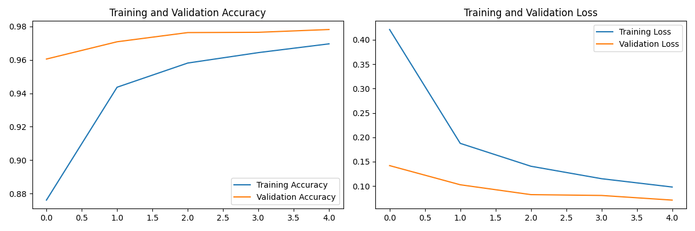
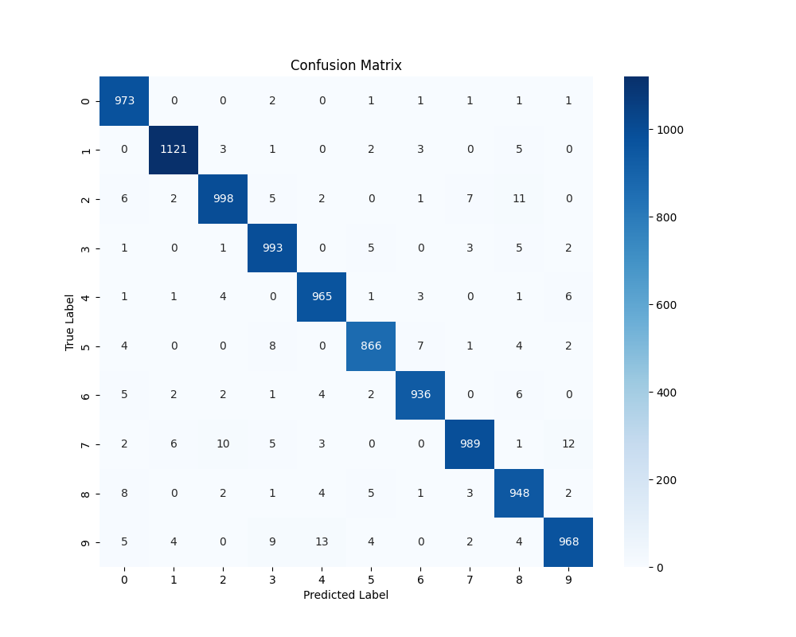

# MNIST Classifier Walkthrough

I have successfully implemented and executed the Neural Network MNIST Classifier.

## Changes Implemented

### Neural Network Model
- Created `mnist_classifier.py` using Keras.
- Implemented a Feed-Forward Neural Network with:
    - Input layer (Flattened 28x28 images)
    - Two hidden layers (128 units, ReLU activation)
    - Dropout layers (0.2) for regularization
    - Output layer (10 units, Softmax activation)
- Trained the model for 5 epochs.

### Documentation
- Created `README.md` with setup and execution instructions.
- Created `requirements.txt` for dependencies.

## Verification Results

### Execution
The script ran successfully and trained the model.

**Test Accuracy:** ~97.5%

### Visualizations

#### Training History
The training history shows the model learning over 5 epochs.


#### Confusion Matrix
The confusion matrix shows the performance of the classifier on the test set.


### Classification Report
```text
              precision    recall  f1-score   support

           0       0.97      0.99      0.98       980
           1       0.99      0.99      0.99      1135
           2       0.98      0.97      0.97      1032
           3       0.97      0.98      0.98      1010
           4       0.97      0.98      0.98       982
           5       0.98      0.97      0.97       892
           6       0.98      0.98      0.98       958
           7       0.98      0.96      0.97      1028
           8       0.96      0.97      0.97       974
           9       0.97      0.96      0.97      1009

    accuracy                           0.98     10000
   macro avg       0.98      0.98      0.98     10000
weighted avg       0.98      0.98      0.98     10000
```
